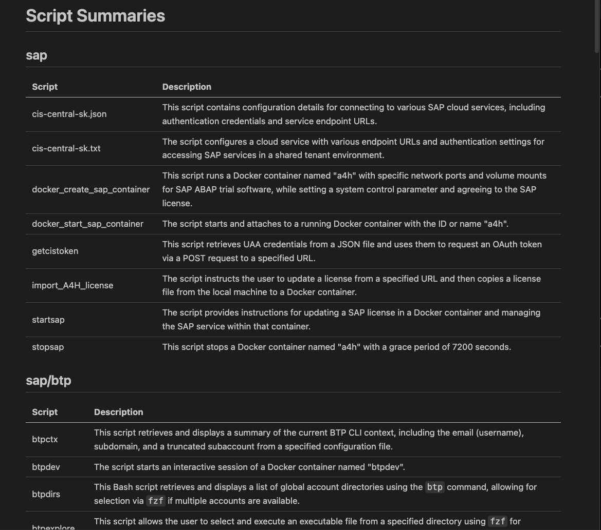

# Script Summarizer

This Python program is designed to automatically analyze and summarize scripts in a given directory or a single file, using OpenAI's GPT-4o-mini model. It then generates a well-structured README_SUMMARY.md file with the summaries.

## Key Features

1. **Flexible Input**: Accepts either a folder path or a single file path as input.
2. **Recursive Analysis**: If given a folder, it recursively analyzes all script files within.
3. **.ignore_files Support**: Respects .ignore_files patterns to exclude specified files and directories.
4. **AI-Powered Summaries**: Utilizes OpenAI's GPT-4o-mini model to generate concise, one-line summaries for each script.
5. **Asynchronous Processing**: Employs asynchronous operations for improved performance when analyzing multiple files.
6. **Structured Output**: Generates a README_SUMMARY.md file with summaries grouped by folders.

## Main Components

1. **ignore_files Parsing**: Reads and interprets .ignore_files files to determine which files to exclude.
2. **File/Folder Analysis**: 
   - For folders: Walks through the directory structure, identifying script files.
   - For single files: Analyzes the specified file directly.
3. **AI Integration**: Sends script content to OpenAI's API for summarization.
4. **README_SUMMARY Generation**: Creates a structured markdown file with summaries grouped by folders.

## Workflow

1. Parse command-line arguments to get the target path.
2. Read the .ignore_files file (if present) from the current directory.
3. Determine if the input is a folder or a single file.
4. For folders:
   - Recursively walk through the directory structure.
   - Identify script files (based on extensions like .py, .js, .sh, etc.) or all files regardless of extension with --all flag.
   - Skip files/folders matching .ignore_files patterns.
5. For each script file:
   - Read its content.
   - Send the content to OpenAI's API for summarization.
   - Store the summary along with the file path.
6. Group the summaries by folder.
7. Generate a README_SUMMARY.md file with:
   - A main title.
   - Sections for each folder.
   - Tables containing file names and their summaries.

## Output

The program produces a README_SUMMARY.md file with the following structure:

- Main title "Script Summaries"
- Sections for each folder (including a "Root" section for files in the base directory)
- Tables under each section with columns for script names and their summaries

This structure provides a clear, organized overview of all scripts in the project, making it easy for developers to understand the purpose of each script at a glance.

## Installation

To set up the Script Summarizer on your local machine, follow these steps:

1. Clone the repository:
```bash
git clone https://github.com/yourusername/script-summarizer.git && cd script-summarizer
```
2. Create a virtual environment:
```bash
python3 -m venv .venv
```
3. Activate the virtual environment:
```bash
source .venv/bin/activate
```
4. Install the required packages:
```bash
pip install -r requirements.txt
```
5. Set up your OpenAI API key:
- Create a `.env` file in the project root
- Add your API key to the file:
  ```
  OPENAI_API_KEY=your_api_key_here
  ```

6. You're now ready to use the Script Summarizer!

## Usage

Here's an example script of how to use the script-summarizer.py script from anywhere in the terminal:

```bash
#!/usr/bin/env bash
main() {
  # Check if the correct number of arguments are supplied
  if [ "$#" -eq 0 ]; then
      echo "Usage: $(basename $0) [-h] [--all] path"
      exit 1
  fi

  cd ~/Developer/python/script-summarizer
  source ./.venv/bin/activate
  python main.py "$@"
  deactivate
  cd - > /dev/null 2>&1
}
main "$@"
```

## Example of README_SUMMARY.md

